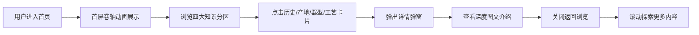

## 1. 产品概述

「瓷韵堂」陶瓷知识学习百科，致力于通过精美的图文展示和沉浸式的互动体验，系统呈现中国陶瓷五千年的发展脉络、名窑产地、器型美学与烧制工艺。面向陶瓷爱好者、艺术专业学生和传统文化研究者，打造一个有温度、有深度、有美感的陶瓷文化学习平台。

## 2. 核心特性

### 2.1 功能模块

1. **陶瓷首页**：沉浸式首屏、四大知识分区导航、精选推荐卡片
2. **发展历史**：时间轴展示从新石器时代到现代的陶瓷发展史
3. **主要产地**：中国六大窑系与当代产瓷区地图式展示
4. **器型分类**：按用途和形态分类的陶瓷器型图谱
5. **烧制工艺**：工艺流程可视化与釉彩知识详解
6. **详情弹窗**：点击卡片查看深度图文介绍与高清展示

### 2.3 页面详情

| 页面名称 | 模块名称 | 功能描述 |
|-----------|-------------|---------------------|
| 陶瓷百科主页 | 首屏 Hero | 卷轴展开动画、主题诗词、瓷瓶剪影、动态背景纹理 |
| 陶瓷百科主页 | 导航栏 | 固定顶部、悬停下划线动画、四大分区快捷跳转 |
| 陶瓷百科主页 | 发展历史区 | 横向时间轴、朝代节点、悬停预览、点击展开详情 |
| 陶瓷百科主页 | 主要产地区 | 窑系卡片网格、产地标识、代表作品缩略图、色调区分 |
| 陶瓷百科主页 | 器型分类区 | 器型剪影图标、分类标签切换、悬停展示线描图 |
| 陶瓷百科主页 | 烧制工艺区 | 步骤流程图解、互动高亮、釉色色谱展示 |
| 通用 | 详情弹窗 | 图文混排、高清图、返回按钮、平滑过渡动画 |

## 3. 核心流程

## 4. 用户界面设计

### 4.1 设计风格

**美学定位：新中式·东方雅韵**

- **主色调**：
  - 霁蓝 `#2C3E50`（元青花之色，沉稳大气）
  - 釉里红 `#A83232`（铜红釉色，点睛之笔）
  - 青瓷灰 `#8BA888`（越窑秘色，温润如玉）
- **辅助色**：
  - 米白釉 `#F5F1E8`（瓷胎底色，温润背景）
  - 墨褐 `#3D2B1F`（深棕描边，古卷质感）
  - 描金 `#C9A962`（钧窑金斑，高贵点缀）
- **按钮样式**：圆角矩形 8px、微浮雕阴影、悬停上浮+描边发光
- **字体**：
  - 标题：「思源宋体」/「Noto Serif SC」，典雅有书卷气
  - 正文：「思源黑体」/「Noto Sans SC」，清晰易读
  - 装饰：「Ma Shan Zheng」/「ZCOOL XiaoWei」，书法笔触
- **布局风格**：卷轴式纵向滚动、卡片式网格布局、大量留白透气
- **特色装饰**：冰裂纹纹理背景、祥云纹样分隔线、印章式标签、毛笔刷痕装饰

### 4.2 页面设计概览

| 页面名称 | 模块名称 | UI 元素 |
|-----------|-------------|-------------|
| 陶瓷百科主页 | 首屏 Hero | 卷轴展开动画、陶瓷主题诗词、瓷瓶轮廓剪影、颗粒纹理背景、向下滚动提示 |
| 陶瓷百科主页 | 发展历史区 | 横向滚动时间轴、朝代替换颜色、节点发光动画、卡片浮起效果 |
| 陶瓷百科主页 | 主要产地区 | 2x3 卡片网格、每个窑系专属背景色、印章样式标签、悬停放大位移 |
| 陶瓷百科主页 | 器型分类区 | 器型 SVG 线描图标、分类 Tab 切换、悬停显示器型名称+注释 |
| 陶瓷百科主页 | 烧制工艺区 | 竖向流程图、步骤编号徽章、釉色圆形色谱、连线动画 |
| 通用 | 详情弹窗 | 半透明毛玻璃遮罩、内容区域卷轴风格、图文左右布局、平滑缩放进入 |

### 4.3 响应式设计

- **设计策略**：Desktop First，移动端自适应
- **断点**：1280px（桌面）、768px（平板）、480px（手机）
- **移动端调整**：时间轴改为竖向、卡片改为单列、字号缩放、触控区域≥44px
- **触摸优化**：卡片点击反馈、滑动切换分类、弹窗手势关闭

### 4.4 视觉特色

1. **卷轴展开**：首屏以中国传统画卷形式徐徐展开主题
2. **冰裂纹底纹**：背景使用哥窑冰裂纹 SVG 纹理，营造陶瓷质感
3. **印章标签**：产地标签采用红色印章样式，模拟文物鉴定章
4. **毛笔笔触**：分区标题使用 SVG 笔刷装饰，增添人文气息
5. **釉色流动**：悬停时背景呈现渐变釉色流动效果
