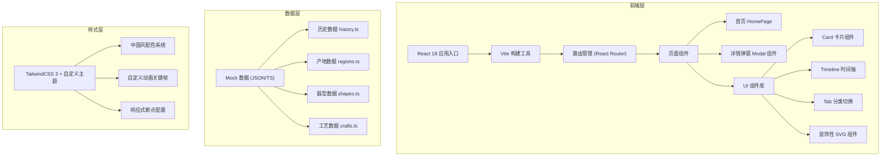

## 1. 架构设计



## 2. 技术描述

- **前端框架**：React@18 + TypeScript
- **构建工具**：Vite@5（热更新、极速构建）
- **样式方案**：TailwindCSS@3（原子化 CSS + 自定义主题配置）
- **路由管理**：React Router DOM@6（单页路由，支持深层链接）
- **图标方案**：自定义 SVG 组件（器型线描图、装饰纹样）
- **数据来源**：本地 TypeScript Mock 数据（无需后端，便于演示）
- **字体方案**：Google Fonts CDN 加载中文字体（思源宋体、思源黑体、书法字体）

## 3. 目录结构

```
/
├── src/
│   ├── main.tsx              # 应用入口
│   ├── App.tsx               # 根组件
│   ├── index.css             # 全局样式 + Tailwind 指令 + 自定义主题
│   ├── components/
│   │   ├── layout/
│   │   │   ├── Navbar.tsx        # 顶部导航栏
│   │   │   ├── HeroSection.tsx   # 首屏卷轴区域
│   │   │   └── Footer.tsx        # 页脚
│   │   ├── sections/
│   │   │   ├── HistorySection.tsx    # 发展历史区
│   │   │   ├── RegionsSection.tsx    # 主要产地区
│   │   │   ├── ShapesSection.tsx     # 器型分类区
│   │   │   └── CraftsSection.tsx     # 烧制工艺区
│   │   ├── cards/
│   │   │   ├── HistoryCard.tsx       # 历史卡片
│   │   │   ├── RegionCard.tsx        # 产地卡片
│   │   │   ├── ShapeCard.tsx         # 器型卡片
│   │   │   └── CraftStepCard.tsx     # 工艺步骤卡片
│   │   ├── common/
│   │   │   ├── DetailModal.tsx       # 通用详情弹窗
│   │   │   ├── SectionTitle.tsx      # 带装饰的分区标题
│   │   │   ├── SealLabel.tsx         # 印章样式标签
│   │   │   └── Decorative/           # SVG 装饰组件目录
│   │   └── hooks/
│   │       └── useScrollAnimation.ts # 滚动触发动画
│   ├── data/
│   │   ├── history.ts            # 发展历史数据
│   │   ├── regions.ts            # 产地窑系数据
│   │   ├── shapes.ts             # 器型分类数据
│   │   └── crafts.ts             # 烧制工艺数据
│   ├── types/
│   │   └── index.ts              # TypeScript 类型定义
│   └── assets/
│       └── patterns/             # 冰裂纹、祥云纹样 SVG
├── tailwind.config.js            # Tailwind 主题扩展
├── vite.config.ts                # Vite 配置
├── tsconfig.json
└── package.json
```

## 4. 路由定义

| 路由 | 用途 |
|-------|---------|
| `/` | 陶瓷百科主页（含四大知识分区 + 详情弹窗交互） |

> 详情采用 Modal 弹窗形式呈现，无需单独路由页面，保持单页沉浸式体验。

## 5. 数据模型

### 5.1 类型定义

```typescript
// 陶瓷历史时期
interface HistoryPeriod {
  id: string;
  dynasty: string;          // 朝代名称
  period: string;           // 时间跨度
  color: string;            // 时代主题色
  summary: string;          // 简介
  description: string;      // 详细描述
  achievements: string[];   // 重要成就
  representative: string[]; // 代表作品
  image: string;            // 配图描述
}

// 产地/窑系
interface Region {
  id: string;
  name: string;             // 窑系/产地名称
  location: string;         // 地理位置
  era: string;              // 兴盛时期
  specialty: string;        // 特色品类
  color: string;            // 主题色（釉色）
  description: string;      // 详细介绍
  features: string[];       // 工艺特征
  masterpieces: {           // 代表作品
    name: string;
    desc: string;
  }[];
  famousFor: string[];      // 扬名之处
}

// 器型分类
interface ShapeCategory {
  id: string;
  category: string;         // 大类名称（如：饮食器、陈设器）
  items: ShapeItem[];
}

interface ShapeItem {
  id: string;
  name: string;             // 器型名称
  alias: string;            // 别名/俗称
  era: string;              // 盛行朝代
  silhouette: string;       // SVG 线描图标识
  description: string;      // 器型描述
  features: string[];       // 造型特征
  usage: string;            // 用途
  variants: string[];       // 变体款式
}

// 烧制工艺
interface CraftProcess {
  id: string;
  name: string;             // 工艺名称
  steps: CraftStep[];
  glazes: GlazeColor[];
}

interface CraftStep {
  id: string;
  step: number;             // 步骤序号
  title: string;            // 步骤名称
  icon: string;             // 图标标识
  description: string;      // 操作描述
  details: string;          // 技术细节
  tips: string;             // 匠人经验
}

interface GlazeColor {
  name: string;             // 釉色名称
  color: string;            // 色值
  description: string;      // 釉色介绍
  formula: string;          // 配方简述
}
```

## 6. 关键技术实现要点

### 6.1 特色动画方案
- **卷轴展开**：CSS `clip-path` + `transform` + `@keyframes` 模拟画卷展开
- **冰裂纹纹理**：SVG `<pattern>` + `opacity` 叠加作为背景
- **时间轴滚动**：`Intersection Observer` 实现节点逐个点亮
- **卡片悬停**：`transform: translateY + rotate` + 多层阴影
- **弹窗过渡**：Framer Motion（如轻量则纯 CSS transition）

### 6.2 性能优化
- 图片使用 WebP 格式 + 懒加载
- 组件按需懒加载（React.lazy）
- SVG 内联减少网络请求
- CSS 动画优先使用 GPU 加速属性（transform、opacity）

### 6.3 无障碍
- 所有装饰性 SVG 添加 `aria-hidden="true"`
- 卡片使用语义化 `<article>` 标签
- 弹窗支持键盘 ESC 关闭 + 焦点管理
- 颜色对比度满足 WCAG AA 标准
